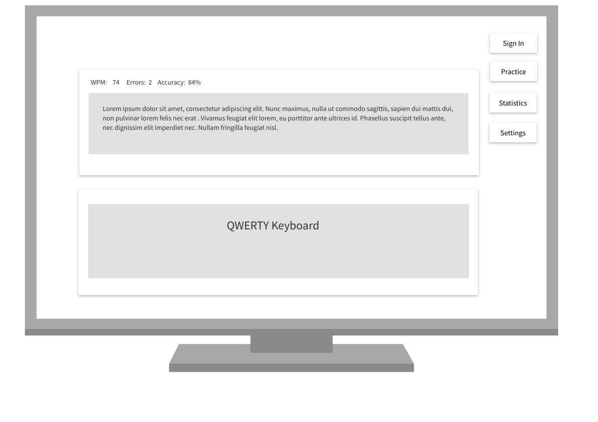

# Coding Focused Typing Tutor
#### General Assembly SEIR 110 Capstone Project

### Project Description
- Coding Focused Typing Tutor
    - Place for begginer and intermediate programmers to work on their typing speed with coding specific symbols, commands, and phrases

***

### User Story

*** 

### Wireframes

***

### Verision 1 - MVP

- React Front End
- generated code block
- timer
- typing stats
    - wpm
    - errors
    - errors per min
- 

### V2 

- django backend
- user authentication
- saved stats
- 

### V3

- qwerty keyboard on screen showing letters typed
- graphs in user stats
- choice of programming language
- 

*** 

### Components
| Component              | Priority | Estimated Time | Time Invested | Actual Time |
| --------- | :------: | :------: | :------: | :------: |
**V1**
| Timer | H | 30 min |
| Code Block | H | unknown | 
| Typing Stats | H | 2 hrs |
| 
